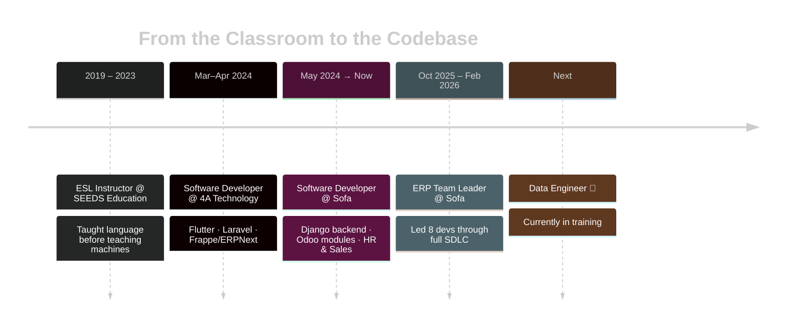

<!-- ============================================== -->
<!--   AHMED AL-MAQTARI — GITHUB PROFILE README    -->
<!-- ============================================== -->

<div align="center">

<!-- Animated gradient wave banner -->


</div>

<br/>

<!-- ================= TERMINAL INTRO ================= -->
<div align="center">

</div>

<div align="center">

<a href="mailto:mr.numberone312@gmail.com"></a>


<br/><br/>


</div>

<br/>

## 🧬 whoami --verbose

<table align="center">
<tr>
<td valign="top" width="55%">

```js
const ahmed = {
  pronouns:       "he / him",
  location:       "Sana'a, Yemen 🇾🇪",
  title:          "ERP Team Lead & Odoo Developer",
  bio:            "Turned language teaching into leading dev teams —
                    now teaching data how to speak analytics.",
  ledTeamOf:      8,
  gpa:            "97.74% (Ranked #1 🥇)",
  currentlyLearning: ["Data Engineering", "AI Engineering"],
  askMeAbout:     ["Odoo", "Django", "ERP architecture", "SQL"],
  funFact:        () => "Ex-ESL instructor who now debugs
                          in Python instead of grammar 😄",
};

console.log(ahmed.funFact());
```

</td>
<td valign="top" width="45%">

**⚡ Quick Stats**

- 🏗️ **2+ yrs** shipping production Odoo/Django systems
- 👥 **8-person team** led through full SDLC
- 🎓 **#1 in class**, Sana'a University
- 🌍 Bilingual: taught English before writing code
- 🚀 Actively pivoting → **Data Engineering**

</td>
</tr>
</table>

---

## 🖥️ Tech Arsenal

<div align="center">

</div>

<div align="center">


</div>

<br/>

<div align="center">

**Odoo Development** `Experienced`


**Django Development** `Experienced`


**System Analysis** `Intermediate`


**Data Engineering** `Developing 📈`


**AI Engineering** `Foundational 🌱`


</div>

---

## 🗺️ The Journey (so far)



---

## 🏆 Achievements Unlocked

<div align="center">

| 🎖️ | Achievement |
|:---:|---|
| 🥇 | **#1 in class** — B.Sc. Computers & IT, Sana'a University (GPA 97.74%) |
| 👨‍💼 | **Team Lead** — scaled an 8-person Odoo dev team through full SDLC |
| 🌐 | **590/677 TOEFL ITP** — certified by ETS |
| 🗣️ | **3+ years teaching** — before pivoting into software |
| 🧩 | **4 bootcamps completed** — Data Engineering, AI, Blockchain/Web3, PHP |

</div>

<details>
<summary>🕹️ <b>Click to reveal a secret achievement</b></summary>
<br/>

```
🎉 ACHIEVEMENT UNLOCKED: "Career Shapeshifter"
   Went from grading essays to reviewing pull requests.
   Difficulty: ★★★★★
   Reward: A very confused but proud LinkedIn feed.
```

</details>

---

## 📈 GitHub Stats

<div align="center">

<!--  -->


</div>

> 🔧 These pull live data for `Mr-NumberOne` automatically. If a card shows a broken-image icon, it's almost always the shared free-tier host being rate-limited — reload after a minute, or see the self-host note below.

---

## 🐍 Bonus Trick: Contribution Snake

The included `snake.yml` workflow makes a snake eat your contribution graph and publishes it as an SVG/GIF. Once the workflow has run at least once (see note below), it renders live right here:

<picture>
  <source media="(prefers-color-scheme: dark)" srcset="https://raw.githubusercontent.com/Mr-NumberOne/Mr-NumberOne/output/github-contribution-grid-snake-dark.svg" />
  <source media="(prefers-color-scheme: light)" srcset="https://raw.githubusercontent.com/Mr-NumberOne/Mr-NumberOne/output/github-contribution-grid-snake.svg" />
  
</picture>

> ⚠️ **First-time setup:** this stays a broken image link until the workflow has actually run once and created the `output` branch. Go to your repo's **Actions** tab → select **Generate Contribution Snake** → click **Run workflow** to trigger it manually the first time. After that it re-runs automatically every day via the cron schedule.

---

<div align="center">

### 📬 Let's Build Something

<a href="mailto:mr.numberone312@gmail.com">
  
</a>

<br/><br/>


<br/>


<i>"Graduated #1 in class. Now compiling my next chapter." 💻</i>

</div>
